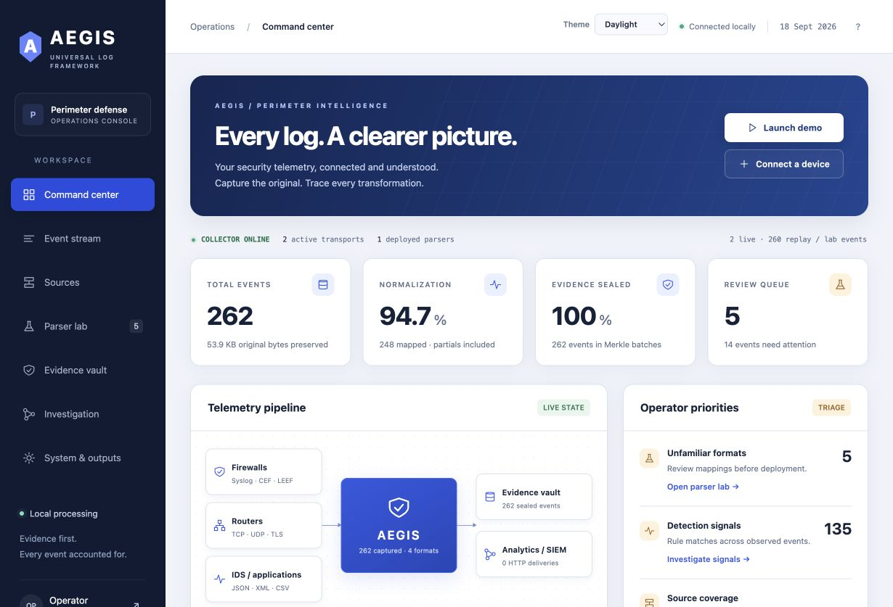

# LOGFLUX

**Universal Log Intelligence · SIH Problem Statement 26156 · NTRO**

An offline-capable cybersecurity workspace for collecting perimeter logs, reviewing new parsers, and tracing normalized events back to original evidence.

[Quick start](#start) · [How it works](#how-it-works) · [Feature coverage](docs/FEATURES.md) · [Architecture](docs/architecture.md) · [2-minute demo script](docs/demo-script.md) · [Verification report](docs/VERIFICATION.md)

**Joining the team? Start with [TEAM_SETUP.md](docs/TEAM_SETUP.md)** for clone/download, installation, login and demo instructions.

LOGFLUX is a working, single-node perimeter-log prototype. It receives real network messages, preserves the original bytes, normalizes supported formats, and sends unfamiliar structures through a reviewed parser workflow. The dashboard, API, evidence verification, parser signatures, local AI adapter and exports use real backend operations.



---

## How it works

LOGFLUX is not just a log aggregator — it is a **tamper-evident, self-healing, AI-assisted telemetry intelligence system**. Every byte that enters the system is preserved in its original form before anything else happens to it. The pipeline is designed around one core principle: **you can always trace a normalized event back to the original packet, byte-for-byte.**

Here is the complete data flow, from your live cyber range to the investigation workbench:

```
                        LIVE CYBER RANGE
                               │
       ┌───────────────────────┼───────────────────────┐
       ↓                       ↓                       ↓
    FIREWALL                 ROUTER                    IDS
       │                       │                       │
       └───────────────────────┼───────────────────────┘
                               ↓
                       ┌───────────────┐
                       │ EVENT CAPTURE │  ← TCP · UDP · TLS Syslog · file · HTTP
                       └───────┬───────┘
                               ↓
                   ┌────────────────────────┐
                   │      EVIDENCE VAULT    │
                   │  RAW BYTES + SHA-256   │
                   │  TIMESTAMP + SOURCE ID │
                   └───────────┬────────────┘
                               ↓
                   ★ MERKLE TREE (per batch) ★
                               ↓
                   ★ PERMISSIONED LEDGER ANCHOR ★
                     (tamper-evident chain of custody,
                      air-gap sync tolerant)
                               ↓
                   ┌────────────────────────┐
                   │  TELEMETRY FINGERPRINT │
                   └───────────┬────────────┘
                               ↓
                   ┌───────────┴───────────┐
                   ↓                       ↓
                KNOWN                   UNKNOWN
                   ↓                       ↓
           PLUGIN REGISTRY          DISCOVERY ENGINE
                                           │
                      ┌────────────────────┼────────────────────┐
                      ↓                    ↓                    ↓
             STRUCTURE DISCOVERY   SEMANTIC DISCOVERY   BEHAVIOR DISCOVERY
             ★ Drain3 / Spell     ★ LLM proposes field  (cross-source signal)
               template mining       mapping →
                                   ★ deterministic validator
                                     (regex / type / pattern check)
                      └────────────────────┼────────────────────┘
                                           ↓
                                   CANDIDATE PARSER
                                           ↓
                             ★ WASM/WASI SANDBOX ★
                             (no fs, no net, 64 KiB memory,
                              10,000 fuel cap)
                                           ↓
                                    REPLAY ENGINE
                             ★ + property-based fuzzing ★
                             (mutation testing: fails safe,
                              never silent data loss)
                                           ↓
                           CROSS-SOURCE VALIDATION
                       ★ weighted confidence score ★
                                           ↓
                         HUMAN APPROVAL GATE
                       ★ prioritized review queue ★
                       (ranked by confidence, not FIFO)
                                           ↓
                             SIGNED PLUGIN
                       ★ bundle = binary + SBOM +
                         test vectors + Ed25519 sig ★
                       (single-file, air-gap transferable)
                                           ↓
                           PRODUCTION REGISTRY
                                           ↓
                            PARSE + NORMALIZE
                                           ↓
                   ★ UNIVERSAL EVENT SCHEMA ★
                     (OCSF/ECS-aligned, embedded
                      schema-version hash)
                                           │
             ┌─────────────────────────────┼──────────────────────┐
             ↓                             ↓                      ↓
      DATA QUALITY                   EVENT GRAPH              SIEM / AI
             ↓                             ↓
      DRIFT DETECTION ────────────────────→ re-route drifted events
             │                         back to discovery
             └──────────────────────────────────────────────────────┐
                                           ↓                        │
                                   SELF-HEALING                     │
                                   (approved replay)  ←─────────────┘

                          (from EVENT GRAPH) ↓
                                   ATTACK TIMELINE
                                           ↓
                            ★ PROVENANCE GRAPH ★
                         (raw → parser v.x → normalized
                          event → alert → case lineage,
                          queryable)
                                           ↓
                                   INVESTIGATION
```

---

### Stage-by-stage breakdown

#### ① Capture — *trust nothing, preserve everything*

Firewalls, routers, and IDS appliances stream Syslog over **TCP, UDP, and TLS** (ports 5514/6514). LOGFLUX also accepts **file upload and authenticated HTTP**. A bounded receiver writes the **original bytes to immutable evidence storage before any parsing begins** — meaning even a catastrophically wrong parser can never destroy the raw record.

#### ② Evidence Vault — *the unforgeable ground truth*

Every received message is stored with:
- `SHA-256` of the original bytes
- Source IP and transport identity
- Nanosecond receipt timestamp
- Framing (octet-counted / newline / HTTP)

These leaves are batched into a **Merkle tree**, and each checkpoint is signed by a **2-of-3 local Ed25519 witness quorum** — forming a hash-chained, permissioned ledger anchor. Witnesses share one host in the prototype (demonstrating the mechanism, not independent custody).

#### ③ Telemetry Fingerprint → Known or Unknown

Each ingested event's structure is matched against the **Plugin Registry**. Known formats (FortiGate, Cisco ASA, Suricata JSON, CEF, LEEF, pfSense CSV…) go directly to the approved parser. **Unknown or structurally drifted events are routed to the Discovery Engine** — they are never silently dropped.

#### ④ Discovery Engine — *three lenses on every unfamiliar format*

| Discovery mode | What it does |
|---|---|
| **Structure** | Drain3 / Spell template mining extracts recurring token patterns from raw text |
| **Semantic** | A local LLM (Qwen3 0.6B) *proposes* field-to-schema mappings — output is untrusted data, checked by validators |
| **Behavior** | Cross-source confidence weighting catches formats that appear across multiple senders |

The LLM cannot approve, deploy, or modify anything by itself. All proposals are passed through **deterministic regex/type/pattern checks** before a candidate parser is assembled.

#### ⑤ WASM/WASI Sandbox + Replay Engine — *zero-trust parser execution*

Candidate parsers run in **Wasmtime** with:
- No filesystem or network imports
- 64 KiB memory ceiling
- 10,000 fuel cap (prevents infinite loops)

The **Replay Engine** then runs the parser against all retained events for that format, including **property-based fuzzing with mutation testing** — the parser must never silently lose data, must fail loud.

#### ⑥ Human Approval Gate — *the last line of defence*

The review queue is **ranked by weighted confidence score**, not FIFO — the most-likely-correct parsers surface first. A reviewer sees the raw bytes, the proposed field mappings, semantic assertions, and the full validation report before approving. No parser enters production without a human signature.

#### ⑦ Signed Plugin Bundle — *portable, verifiable, air-gap safe*

Approved parsers are packaged as a **single signed bundle**:

```
bundle = WASM binary + SBOM + test vectors + Ed25519 signature
```

Bundles are importable/exportable from the UI and transferable across air-gapped environments. The registry pins trusted public keys; only bundles signed by a known key can activate.

#### ⑧ Universal Event Schema — *one truth for downstream*

All normalized events conform to a **LOGFLUX 1.0 schema** (OCSF/ECS-aligned) with an embedded schema-version hash. Unmapped source fields are preserved. Export formats: JSONL, ECS projection, CSV. HTTP output uses stable idempotency keys and at-least-once delivery with backoff retry.

#### ⑨ Drift Detection + Self-Healing — *the parser stays honest*

A structural fingerprint is computed for every source on an ongoing basis. When a known source's log format **drifts from its baseline** (firmware update, config change), LOGFLUX quarantines the drifted events and routes them back through the Discovery Engine. Once a new parser version is approved, **retained events replay as new revisions** — originals never change.

#### ⑩ Provenance Graph → Investigation — *every alert has a receipt*

The full lineage of every event is queryable:

```
raw bytes → parser v.x → normalized event → alert signal → saved case
```

The Investigation workspace lets you select IP nodes, filter by source and receipt time, inspect scoped signals, follow the attack timeline, and save evidence cases. Every case links back to the original Merkle-verified bytes.

---

## Project status

**Working single-node prototype; the full enterprise specification is not complete.** The dark LOGFLUX interface and backend workflows are implemented. Physical firewall validation, independent remote witnesses, a verified Docker deployment and distributed billion-event scaling remain outstanding.

| Workspace | What it does |
|---|---|
| Command Center | Actual event counts, saved cases, rule signals, IP-pair relationships, source distribution and 30-minute activity charts |
| Event Stream | Source/status/mode search, raw-versus-normalized inspection, revisions and exports |
| Sources | Register device senders, inspect transport status and separate live, replay and lab traffic |
| Parser Lab | Discover unfamiliar structures, review suggested mappings, validate, sign, version and replay retained events |
| Evidence Vault | Original hashes, related cases, Merkle checkpoints and on-demand evidence verification |
| Investigation | Select IP nodes, zoom, filter by source/receipt time, inspect scoped signals and save evidence cases |
| System & Outputs | Runtime status, local model availability, schema information and retrying HTTP outputs |

The default **Obsidian** theme uses violet accents on dark surfaces; **Pearl** and **Rose** are also available. All assets are served locally. Graphs show observed IP addresses, not inferred wallet ownership, host identities or users. Some analytics are bounded to the latest 1,000 matching events or latest 100 alerts; these limits are labeled in the interface.

## Start

Requires Python 3.12+ (tested with Python 3.14 on Apple Silicon). Start with 4 GB RAM for collection; allow extra memory for a local model. No Node build or cloud account is needed.

Clone the default branch first (the runnable project is at the repository root):

```sh
git clone https://github.com/Sachin-MS-77/LOGGER.git
cd LOGGER
```

macOS / Linux:

```sh
sh scripts/setup.sh
.venv/bin/python scripts/run.py
```

Windows PowerShell:

```powershell
py -3 -m venv .venv
.venv\Scripts\python -m pip install -r requirements.lock
.venv\Scripts\python scripts\run.py
```

Open **http://127.0.0.1:8765**. Paste the token from `data/admin-token`. The browser keeps it only for its current session. Runtime data, private keys and tokens must stay out of source-control and submitted ZIP files.

For the already-installed demo on this computer, double-click **Start LOGFLUX.command** at the root of this project. It uses the prepared workspace runtime and preserved demo database. If moving the source elsewhere, use the installation steps above.

## Demonstrate the complete flow

1. **Command center → Run demo replay:** inject 120 explicitly labeled synthetic events across five source families. Counters and graphs come from stored events.
2. **Event stream:** search, filter by source/status/traffic mode, pause refresh, inspect raw bytes beside normalized fields.
3. **Parser lab:** select the unfamiliar router format. Review the deterministic suggestion or request a **Local AI proposal**. `origin` is the source address and `target` is the destination in the included synthetic fixture.
4. Add semantic assertions for a displayed sample, then **Save & validate**. Review the results, enter your reviewer name and approve. Validation does not replace semantic review.
5. **Replay retained events:** a new normalized revision appears while the original byte hash stays unchanged. **New parser version** creates a draft without overwriting prior approval. The registry supports signed bundle import/export and activation/rollback.
6. **Trigger sample drift:** the changed FortiGate fixture enters review. Map `client_ip` and `server_ip`, validate, approve and replay.
7. **Evidence vault:** inspect an event and choose **Verify evidence**. Hash, manifest, Merkle path and quorum signatures are checked when requested.
8. **Investigation:** select an address, inspect its timeline and detections, and save a case. Shared IPs indicate observations, not a proven attack narrative.
9. **System & outputs:** export complete JSONL, an ECS projection, or CSV. Configure an HTTP collector to demonstrate the durable retry outbox.

## Connect a real firewall or router

A device must export logs. LOGFLUX cannot automatically understand every proprietary format or connect to devices with no accessible log interface.

Start the collector on the intended network interface:

```sh
LOGFLUX_SYSLOG_HOST=0.0.0.0 .venv/bin/python scripts/run.py
```

Keep the dashboard bound to loopback, or place an authenticated HTTPS reverse proxy in front of it. In the device's remote-log settings, choose the collector computer's LAN IP and TCP port **5514** or UDP port **5514**. Allow that port on the host firewall. Register the sender IP under **Sources**. Do not send to `127.0.0.1` from another machine.

TCP accepts RFC6587 octet-counted frames and newline frames. UDP is best effort: messages dropped before receipt cannot be recovered. HTTP upload supports exact single-message bytes or newline framing. Use `scripts/send_logs.py` to send a captured fixture with preserved bytes.

```sh
.venv/bin/python scripts/send_logs.py samples/perimeter.log --transport tcp
```

TLS with a certificate trusted by the sender:

```sh
LOGFLUX_SYSLOG_HOST=0.0.0.0 LOGFLUX_TLS_CERT=/path/server.pem \
LOGFLUX_TLS_KEY=/path/server.key .venv/bin/python scripts/run.py
```

TLS uses **6514**. Set `LOGFLUX_TLS_CA` to require client certificates. Device-specific configuration differs by model and firmware; verify one received event before presenting hardware compatibility.

Included adapters cover tested fixture subsets of FortiGate key/value, Cisco ASA deny messages, Suricata JSON, CEF, LEEF and pfSense CSV. Structural decoders also accept JSON, safe XML, headered CSV, Syslog wrappers, key/value and plain-text token templates. New signatures enter review. Binary/unparseable bytes remain in evidence with a failed status.

## Controlled socket lab

```sh
.venv/bin/python lab/socket_range.py --token-file data/admin-token --count 100
```

This sends synthetic firewall/router/IDS messages through real localhost TCP on the dedicated **5515** lab listener. It does not scan, exploit, emulate a physical firewall or create actual malicious traffic. `lab` and `replay` remain distinct from ordinary device traffic. A mixed-source lab stream can trigger conservative structure-drift review.

## Which ML model is used?

- **Qwen3 0.6B**, alias `qwen3:0.6b`, is an optional local language model for **parser field-mapping proposals**. The recorded test used a Q8_0 GGUF through llama.cpp. Weights and model executables are not included in GitHub.
- **Drain3** mines recurring log templates; it is not a trained attack classifier.
- **Detection signals use deterministic rules**, including IDS signals and blocked management-port connections. No trained anomaly detector, Graph ML model, SHAP explainer or wallet-clustering model is implemented.

### Fracture Index boundary

The redesigned gauge is an **uncalibrated activity heuristic**, not detection accuracy, confidence or threat probability. It computes:

```text
[min(8 × denied/alerted events, 100)
 + min(5 × source-timestamped events, 100)
 + min(6 × unique destinations, 100)] / 4
```

Taint data is unavailable and displayed as N/A. Keeping the existing four-part formula means the maximum currently attainable is **75**, even though the visual scale is 0–100. Traffic volume and valid timestamps increase this number without establishing malicious activity. Do not present it as a validated risk model.

## Local AI

Local model proposals are optional. Manual/deterministic review works without a model. The included adapter supports Ollama and llama.cpp's local OpenAI-compatible endpoint. Default endpoint `http://127.0.0.1:11434`, model alias `qwen3:0.6b`.

For Ollama, stage its runtime and run `ollama pull qwen3:0.6b` while connected, then `ollama serve`. For llama.cpp, load the GGUF locally and use `--alias qwen3:0.6b`. Configure `LOGFLUX_LLM_URL`, `LOGFLUX_LLM_MODEL` and optionally `LOGFLUX_LLM_API_KEY_FILE`. Explicit private-host allowlisting uses `LOGFLUX_LLM_ALLOWED_HOSTS`. No cloud fallback exists.

On this demo computer, a Qwen3 0.6B GGUF and llama.cpp runtime are already staged in the workspace. **Start LOGFLUX.command** can start them. Model weights and the model executable are not included in the portable source ZIP. Transfer the model/runtime separately for another air-gapped computer.

AI output is constrained to known fields and checked against sample types. It cannot approve or deploy itself. The recorded local-model test demonstrates three rejected invalid fields. Model accuracy is not guaranteed.

## Air-gapped setup

On a connected machine matching the target's OS, CPU and Python version:

```sh
python scripts/prepare_offline.py
```

Transfer the source and `wheelhouse/`, a compatible Python installer and any optional model/runtime. On the isolated target, run `scripts/setup.sh`: it installs with `--no-index`. Verify the wheel hashes in `wheelhouse/manifest.json` against a trusted copy before transfer. The build machine's staged wheelhouse targets **macOS ARM64 / Python 3.14** and is excluded from GitHub. Generate a wheelhouse for the actual target platform.

A fresh virtual environment was installed from these wheels without a package index, and all 48 tests passed there. An actual physically disconnected hardware-network test remains an evaluation step. The application serves all assets locally and makes outbound requests only to configured local AI or output endpoints.

## Container deployment

```sh
docker compose up --build
```

The image uses a non-root user, a writable data volume, a read-only root filesystem and no extra Linux capabilities. The dashboard is published on loopback. Syslog ports are exposed for devices. Stage images using `docker save` / `docker load` before isolation; a Docker build itself requires dependencies/base images unless already staged.

**The Docker daemon was unavailable on the build computer.** The configuration is included and statically checked, but an actual image build/run is not claimed.

## Tests and benchmark

```sh
.venv/bin/python -m pytest tests -q
.venv/bin/python scripts/benchmark.py --events 2000 --output docs/benchmark.json
```

The current 54-test suite covers format adapters, random raw preservation, immutable evidence, malformed inputs, replay/semantic checks, parser revisions and rollback, signature trust, sandbox bounds, witness conflicts/catch-up, HTTP auth, real TCP/UDP/TLS sockets, source edits that preserve historical evidence, and HTTP retry idempotency. Upgrade tests also cover legacy configuration, signed pre-rename parser imports, historical schema provenance and graph filters. Two upstream test-library deprecation warnings remain.

Measured on this Mac: **2,000 events, 2,187.8 events/s, 0.08 ms p95 processing**, 1,600 normalized and 400 intentionally unknown, with a verified sealed proof. This sequential Store benchmark excludes network, LLM and concurrent UI. See `docs/benchmark.json` for precise scope. It does not establish sustained production throughput or billions/day.

## API and integrations

All `/api/*` routes require `Authorization: Bearer <token>`. `GET /health` is a shallow public health check. Useful routes:

- `POST /api/sources`, `POST /api/ingest`, `POST /api/upload`
- `GET /api/events`, `GET /api/events/{id}/raw`, `/proof`, `/provenance`
- `GET /api/export?format=jsonl|ecs|csv&offset=0` (maximum 1,000 per page; increment offset)
- `GET /api/candidates`, `PUT /api/candidates/{id}/mapping`, `POST .../validate`, `/approve`, `/replay`, `/revise`
- `GET /api/plugins`, `POST /api/plugins/import`, `POST /api/plugins/{id}/activate`
- `GET /api/metrics` (Prometheus text, authenticated)

HTTP outputs accept LOGFLUX JSON envelopes, use stable delivery IDs and retry with backoff. Receivers should deduplicate on `Idempotency-Key`. Delivery is at least once; it is not exactly once. Native Splunk/Elastic/Kafka/S3 integrations are not included. The ECS adapter is a projection; the canonical schema is LOGFLUX 1.0, not full OCSF conformance.

## Evidence and operating limits

Original event bytes commit before parsing. Normalized revisions are append-only. Evidence leaves commit to the event hash plus receipt/source/transport metadata. Three local Ed25519 witnesses sign ordered Merkle checkpoints with a quorum of two. These witnesses share one machine: this demonstrates signed permissioned checkpoints, not independent custody or a production BFT blockchain. SQLite immutability guards do not protect against a privileged attacker who controls files and all keys.

Wasmtime executes a bounded field-selection module, with no host imports, 64 KiB memory and 10,000 fuel. Trusted Python handles structural decoding. This is not arbitrary LLM-generated parser code running in WASI.

The prototype uses a single SQLite node. There is no Kafka/Flink cluster, object-store retention, independent remote ledger quorum, trained anomaly model, HA failover or RBAC. See `docs/FEATURES.md` for every original-plan item and its actual implementation boundary. Production-scale architecture is a documented next phase, not shipped infrastructure.

## Upgrading an earlier checkout

Back up the private data directory before changing versions. Keep the same data path to retain evidence, cases and signing keys. `LOGFLUX_*` environment variables are preferred; legacy `AEGIS_*` variables remain supported as fallbacks. New variables take priority. Renamed schemas do not rewrite stored revisions or old signed parser payloads; imports accept only the current schema and the exact compatible pre-rename schema hash.

New ECS projections use the `logflux` extension key and metrics use the `logflux_` prefix. Update downstream dashboards/adapters that used the old names. New browser sessions require the existing server token again. Older Docker volumes must be explicitly retained or mounted at `/var/lib/logflux`; changing a Compose project/service name does not migrate data automatically.

## Submission files

- `docs/architecture.pdf` — two pages
- `docs/LOGFLUX-SIH-final.pptx` — existing presentation; review branding/screenshots before submission
- `docs/LOGFLUX-demo.mp4` — 60-second screenshot walkthrough with selectable English captions, no audio
- `docs/demo-script.md` — 30-second PPT + 90-second live demo script
- `docs/FEATURES.md` — requirements and original-plan coverage
- `docs/test-results.xml`, `docs/benchmark.json` — reproducible evidence

Repository: [Sachin-MS-77/LOGGER](https://github.com/Sachin-MS-77/LOGGER). Use the default `main` branch for this verified release. Earlier Claude commits on `master` are retained in its history; this release restores the project to the repository root for straightforward cloning and setup.

The older ZIP, PDF, MP4 and slide artifacts may show previous UI states; they are not a recording of this verification. Record the current application using the updated script and add team details and verified hardware models before submission.
