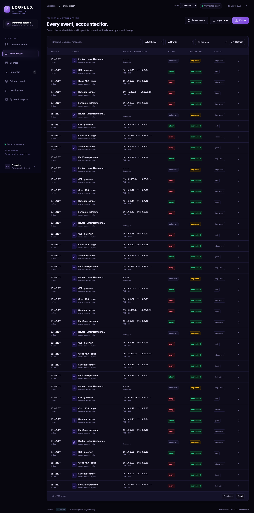
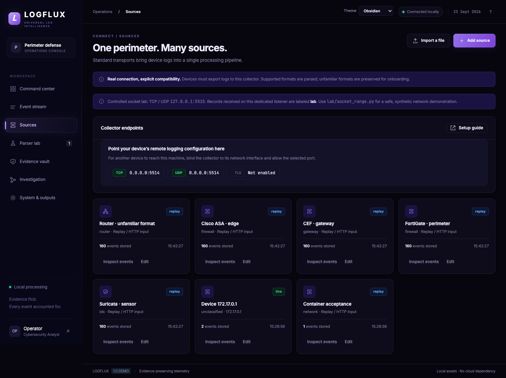
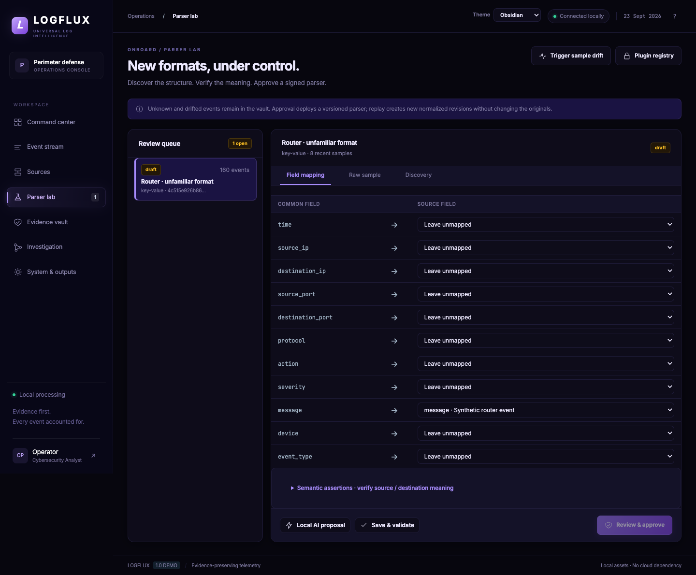
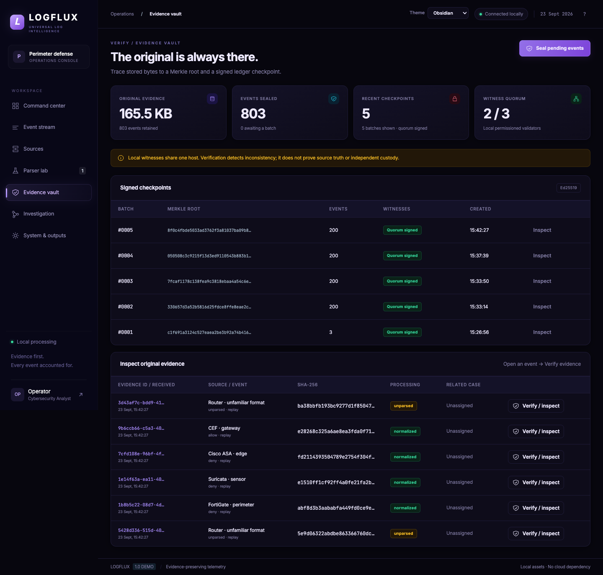
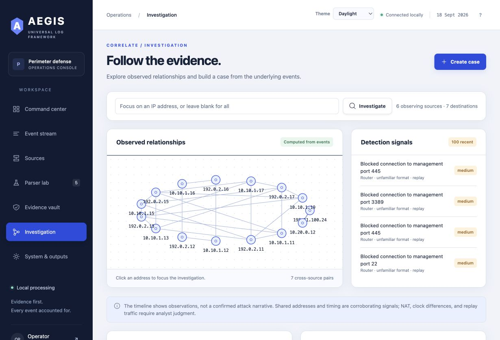
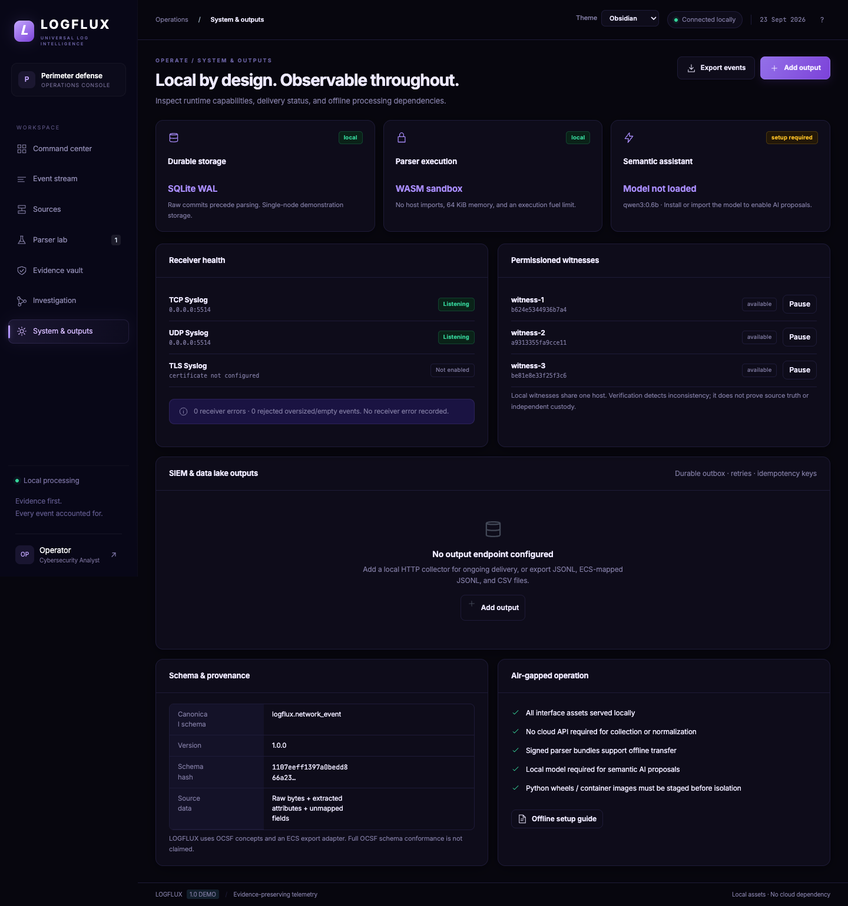

# LOGFLUX

**Evidence-preserving perimeter-log preprocessing with sandboxed, human-reviewed parser adaptation.**

**Docker acceptance:** local verification passed. Hosted CI setup is pending; see the [workflow template](docs/ci/README.md).

SIH problem statement **26156 · NTRO · Blockchain & Cybersecurity**.

LOGFLUX receives device logs, preserves original message bytes, normalizes supported formats, and routes unfamiliar or drifted records into review. An approved, signed parser can replay retained events into new revisions without replacing raw evidence.

**Status:** working single-node application; 81 passing tests; Docker restart acceptance and native Elasticsearch Bulk verification passed locally. Three network witness processes and the separate Redpanda/ClickHouse worker experiment were exercised on one computer. Full OCSF conformance, replicated enterprise storage, independent-machine custody and billion-events/day capacity are **not** claimed. The saved GitHub token lacks workflow permission, so the CI template is included for a repository maintainer to install; no hosted CI pass is claimed.

[Team setup](docs/TEAM_SETUP.md) · [Measured results](#measured-results) · [Requirement coverage](#requirements-a-k) · [Architecture](docs/architecture.pdf) · [Verification](docs/VERIFICATION.md) · [Integration commands](docs/INTEGRATIONS.md)


## Start

Requires Python 3.12+; tested locally with Python 3.14 on macOS ARM64 and Python 3.12 in Docker. No frontend build or cloud account is required.

```sh
git clone https://github.com/Sachin-MS-77/LOGGER.git
cd LOGGER
sh scripts/setup.sh
.venv/bin/python scripts/run.py
```

Windows PowerShell:

```powershell
py -3 -m venv .venv
.venv\Scripts\python -m pip install -r requirements.lock
.venv\Scripts\python scripts\run.py
```

Open **http://127.0.0.1:8765** and use the locally generated token in `data/admin-token`. Keep tokens, raw operational logs and private keys outside Git. Windows native installation is documented, not independently verified in this review.

Choose **Run demo replay** for 2,187 clearly labeled synthetic events. A fresh clone contains no operational database, model weights or pre-approved parser keys. Theme choices are Obsidian, Pearl and Rose.

## Why the sandbox matters

The **WASM field-selection sandbox** is the central technical feature. Model output is declarative mapping data; it cannot execute arbitrary Python or approve itself. After validation and human approval, signed field-selection modules run with:

- No host imports: filesystem, network and environment access are rejected.
- A 64 KiB linear-memory ceiling and 10,000 execution fuel.
- A 64 KiB binary-input limit and a checked `(i32) -> i32` selector signature.

[Eleven adversarial tests](docs/SECURITY-EVIDENCE.md) exercise loops, memory exhaustion, forbidden imports, malformed modules and invalid signatures. Structural decoding still runs in trusted Python. Bounded execution does not establish correct field meaning; semantic assertions and human review remain necessary. No claim of competitor exclusivity is made.

```text
Firewall / router / IDS → TCP / TLS / UDP / HTTP / file
 → durable original bytes + SHA-256 + source + receipt metadata
 → structural decoding → approved mapping → typed LOGFLUX event
                         ↓ unknown / drifted
                 discovery → review → validation → signed WASM parser
                         ↓ approved replay
                 new normalized revision; original bytes unchanged

Evidence manifests → Merkle batches → signed witness checkpoints
Normalized events → dashboard / cases / JSONL / ECS / CSV / durable outputs
```

## Workspaces and screenshots

These screenshots show the running application with synthetic replay data. Counts are observations from that demonstration, not performance benchmarks.

### Event Stream

Filter by source, processing status and traffic mode. Open a record to compare its original content with the normalized fields and inspect revisions. Failed or unknown records stay visible.



### Sources

Register senders, inspect traffic and separate live, replay and lab modes. A sender must actually export logs; registering a name does not connect arbitrary hardware.



### Parser Lab

Review sample attributes, select mappings, add semantic expectations, validate, approve and replay. Approved bundles are signed and versioned; imports are staged and trusted keys are pinned.



### Evidence Vault

Inspect original hashes, sealed batches and witness receipts. Verification checks raw bytes, manifest fields, Merkle inclusion, ordered checkpoint history and pinned signatures.



### Investigation

Select observed IP addresses, filter the timeline and save cases linked to event IDs. The graph shows observed network relationships, not actor attribution or wallet ownership. Some views use the latest 1,000 matching events or 100 alerts; the UI labels these bounds.



### System & Outputs

Inspect listeners, schema information and local model availability. Configure a generic JSON HTTP sink or the native Elasticsearch Bulk connector. The outbox retries failed deliveries; downstream consumers must tolerate retries.



## Measured results

All numbers describe the specified run. Coverage is not detection accuracy, and offered load is not achieved throughput.

### Public corpus coverage

`python scripts/fetch_datasets.py` stages complete archives and hashes under ignored `data/`. `python scripts/measure_coverage.py --manifest docs/dataset-manifest.json` scans every selected record. It performs a **fresh built-in registry dry-run**, excluding learned plugins, drift history, storage and LLM calls. Metadata lines are separate. Unknown and failed records are retained in the report; 2,000-line samples are never substituted for full corpora.

| Complete file | Records | Normalized % | Partial % | Discovery % | Failed % |
|---|---:|---:|---:|---:|---:|
| linux / Linux.log | 25,567 | 0.0000 | 0.0000 | 99.9218 | 0.0782 |
| apache / Apache.log | 56,482 | 0.0000 | 0.0000 | 100.0000 | 0.0000 |
| openssh / SSH.log | 655,147 | 0.0000 | 0.0000 | 100.0000 | 0.0000 |
| honeynet30 / capture.log | 307,524 | 99.9935 | 0.0000 | 0.0065 | 0.0000 |
| honeynet34 / SotM34/iptables/iptablesyslog | 179,752 | 99.9449 | 0.0000 | 0.0200 | 0.0350 |
| honeynet34 / SotM34/snort/snortsyslog | 69,039 | 0.0000 | 0.0000 | 100.0000 | 0.0000 |
| maccdc2012 / capture.log | 22,694,356 | 0.0000 | 0.0000 | 100.0000 | 0.0000 |


[Complete per-file counts](docs/coverage.json) · [Before the iptables adapter](docs/coverage-before-iptables.json) · [Dataset manifest](docs/dataset-manifest.json)

The iptables adapter preserves repeated inner-packet attributes without overwriting outer addresses. It does not infer allow/deny from INBOUND/OUTBOUND. Linux, Apache, OpenSSH, older Snort text and Zeek text coverage gaps remain visible rather than being hidden behind an aggregate percentage. The before/after improvement here is a coded adapter improvement, not a claim that AI automatically learned these corpora.

Dataset attribution: [Loghub](https://github.com/logpai/loghub) (research/academic terms; see its citation), [Honeynet Scan 30](https://honeynet.onofri.org/scans/scan30/), [Scan 34](https://honeynet.onofri.org/scans/scan34/), [SecRepo](https://www.secrepo.com/). Raw corpora are not redistributed in GitHub.

### File/replay versus live sockets

The historical **file/replay-style, sequential in-process Store baseline** was **2,187.8 events/s** on 2,000 synthetic events. It excludes actual file reading, sockets, LLM calls and a concurrent dashboard: [exact scope](docs/benchmark.json). It must not be presented as a live socket rate.

The actual collector was tested with four concurrent connections for **120 seconds per rate**, on the same computer as the sender. The container supports bounded UDP consumer concurrency through `LOGFLUX_RECEIVER_WORKERS` (default Docker value: 2; allowed range: 1–32). Increase it only after measuring SQLite write contention on the target host. Other local work also used that computer; these are development-machine measurements, not dedicated-host capacity certification.

| Transport | Offered events/s | Actual sent/s | Durable received/s in window | Unreceived after drain |
|---|---:|---:|---:|---:|
| TCP | 500 | 500.00 | 500.00 | 0 (0.0000%) |
| TCP | 2,000 | 1,453.32 | 1,103.35 | 33,052 (18.9521%) |
| TCP | 4,000 | 1,285.47 | 964.61 | 20,052 (12.9992%) |
| TCP | 8,000 | 1,462.38 | 1,082.56 | 28,340 (16.1494%) |
| TCP | 16,000 | 1,658.75 | 1,232.62 | 33,143 (16.6506%) |
| UDP | 500 | 500.00 | 500.00 | 0 (0.0000%) |
| UDP | 2,000 | 2,000.00 | 814.84 | 138,130 (57.5542%) |
| TLS | 500 | 500.00 | 499.38 | 75 (0.1250%) |


At overload, send calls can stall under TCP backpressure. “Unreceived” means not durably observed by the end of a 15-second drain; it can include backlog and does not by itself prove permanent network loss. Uncertain final sends and sender errors are reported separately. TLS showed 75 unreceived records in its run; that discrepancy remains an explicit finding, not a lossless-delivery claim. UDP is always best effort.

Reports: [TCP baseline](docs/benchmark-socket-baseline.json), [TCP overload](docs/benchmark-sustained-final.json), [UDP](docs/benchmark-udp.json), [TLS](docs/benchmark-tls.json). Each report includes an explicitly labeled arithmetic events/day projection; **no 24-hour or billion-event run was performed**.

### Separate broker / columnar experiment

Four Redpanda partitions → independent Python workers → ClickHouse, with durable offset commits, stable event IDs, batch Merkle proofs and aggregate roots. All 2,000 raw hashes and shard proofs verified in each run; resuming committed offsets wrote no additional records.

| Workers | Worker-path events/s | Producer + worker seconds |
|---|---:|---:|
| 1 | 3,003.40 | 1.833 |
| 2 | 4,571.08 | 1.5245 |
| 4 | 4,222.39 | 1.5668 |


Worker-path timing includes process startup, broker reading, normalization, batch proofs, insertion and offset commits. Producer timing is separate; final verification and root aggregation are excluded. Two workers outperformed four in this small run: scaling is **not linear**. These short trials are not sustained capacity results.

The experiment is separate from the SQLite dashboard and its parser registry. It has one broker and one columnar node, static partition assignment, no replication or automatic failover. [Run it](docs/INTEGRATIONS.md). The four-worker aggregate root was signed in the [network witness test](docs/witness-verification.json).

## Requirements a-k

With a running demonstration and existing event/candidate, these actions provide short, reviewable checks. Setup/download/model staging can take longer than a minute. All `/api/*` calls require a Bearer token.

| PS | Requirement | Reviewer action | Boundary |
|---|---|---|---|
| a | Preserve raw event data | `GET /api/events/{id}/raw`; compare exact bytes | After durable acceptance; pre-commit loss is possible |
| b | Extract source attributes | Event inspector → extracted attributes | Tested format subsets; unsupported structures remain explicit |
| c | Common taxonomy | `GET /api/status`; inspect a normalized event | Custom OCSF-inspired schema, not full OCSF |
| d | Traceability | `GET /api/events/{id}/provenance` and `/proof` | Default witnesses share one host |
| e | New-source onboarding | Parser Lab → validate → approve → replay | No restart; human semantics review required |
| f | Unified visibility | Command Center → source/status/mode filters | Bounded graph/alert queries are labeled |
| g | SIEM/lake integration | System & Outputs → Elasticsearch Bulk; inspect delivered count | Live local Elastic test passed; generic HTTP is not Splunk HEC |
| h | AI/ML-ready analytics | Inspect typed JSONL/ECS export; optional Local AI proposal | Qwen3 mapping assistance; detections are rules |
| i | Reduced parser effort | `python -m pytest tests/test_pipeline.py -k unknown_approval -v` | Demonstrates unparsed→normalized without handwritten parser; no measured time-saving claim |
| j | Air gap | System & Outputs → offline guide; inspect local asset requests | Dependencies/models/images must be staged; physically isolated trial pending |
| k | Container | `docker compose up --build -d`, then `GET /health` | Local restart/byte/proof acceptance passed; hosted CI setup pending |

## Real devices and replay

```sh
LOGFLUX_SYSLOG_HOST=0.0.0.0 .venv/bin/python scripts/run.py
```

Set the device's destination to the collector's LAN address, TCP **5514** (preferred) or UDP **5514**, and register the sender. TLS uses **6514** with `LOGFLUX_TLS_CERT` and `LOGFLUX_TLS_KEY`; `LOGFLUX_TLS_CA` enables client-certificate validation. Keep the dashboard on loopback or behind authenticated HTTPS. TCP acknowledgements do not prove durable application receipt.

```sh
.venv/bin/python scripts/send_logs.py samples/perimeter.log --transport tcp --rate 100
```

Earlier team documentation reports a physical-firewall test, but no model/firmware acceptance report is committed; this review does not independently certify that hardware. Existing adapters cover tested FortiGate, ASA deny, Suricata, CEF, LEEF, pfSense and iptables subsets. Other formats require review or a decoder extension.

## Models, scores and schema

- **Qwen3 0.6B** (`qwen3:0.6b`) optionally proposes mappings through Ollama or llama.cpp. Stage the runtime and weights separately. No cloud fallback.
- **Drain3** mines recurring templates; it is not an attack classifier.
- Detections are deterministic rules. No trained anomaly detector, Graph ML, SHAP or wallet clustering is implemented.
- The **Fracture Index** is an uncalibrated activity heuristic: `(min(8×denied/alerted,100) + min(5×source-timestamped,100) + min(6×unique destinations,100)) / 4`. Missing taint is N/A, so its attainable maximum is 75 on a displayed 0–100 scale. It is not threat probability or accuracy.
- LOGFLUX 1.0 is **OCSF-inspired**. ECS export is a partial mapping with the normalized event preserved in an extension.

Configure local model access using `LOGFLUX_LLM_URL`, `LOGFLUX_LLM_MODEL` and optionally `LOGFLUX_LLM_API_KEY_FILE`; explicitly allow private hosts using `LOGFLUX_LLM_ALLOWED_HOSTS`.

## Docker, offline installation and witnesses

```sh
docker compose up --build -d
python scripts/verify_docker.py --container "$(docker compose ps -q logflux)" --api http://127.0.0.1:8765 --port 5514
```

The acceptance script restarts the selected container: use a test deployment. Local checks passed for health, authenticated ingestion, exact bytes, TCP/UDP receipt and proof verification after restart. The image runs non-root with a read-only root filesystem, a persistent volume and dropped capabilities. [Docker evidence](docs/docker-verification.json).

For offline installation, run `python scripts/prepare_offline.py` on a matching OS/CPU/Python machine, transfer the source and wheelhouse, verify its manifest against a trusted copy and install with `--no-index`. Transfer optional model weights/runtime and container images separately. Fonts and interface assets are local.

Optional `LOGFLUX_WITNESS_CONFIG` connects three authenticated services with distinct pinned keys. Quorum, outage, restart/catch-up and conflict tests passed with separate processes on one host. This does **not** prove independent custody. Independent machines and administrators remain necessary. [Deployment and single-witness verification](docs/INTEGRATIONS.md).

## Tests and upgrade notes

```sh
.venv/bin/python -m pytest tests -q
.venv/bin/python scripts/verify_remote_witnesses.py
```

81 tests passed in the final local suite, including 11 sandbox attacks, real TCP/UDP/TLS framing, raw preservation, replay, signatures, source-history preservation, Elastic retry errors and scale offset safety. Two upstream test-library deprecation warnings remain.

Back up the private data directory before upgrading. Keep existing signing keys and volumes. Legacy configuration and exact historical schema hashes remain supported without rewriting evidence. FortiGate `eventtime` records now include epoch-unit information in their fingerprint; existing mappings for those records require review. Changing witness trust sets requires a fresh data directory rather than silently changing historical trust. [Documented drift example](docs/DRIFT-DEMO.md).

## Submission package

- [Five-slide PPT](docs/LOGFLUX-final.pptx): refreshed branding, current screenshots, built-versus-pending boundaries.
- [Two-minute video](docs/LOGFLUX-demo.mp4): 30 seconds of slides + 90 seconds of the real application, captions, no narration audio.
- [Drift clip](docs/LOGFLUX-drift-demo.mp4): excerpt of timestamp-unit review, approval and replay using constructed documented-format fixtures.
- [Demo script](docs/demo-script.md) and [two-page architecture](docs/architecture.pdf).
- [SIH idea title](docs/submission/idea-title.txt) and [40,000-character description](docs/submission/idea-description.txt), below the stated 50,000-character limit.
- [Drawback resolution](docs/DRAWBACKS.md), [security evidence](docs/SECURITY-EVIDENCE.md), [verification](docs/VERIFICATION.md).

## Team

| Name | Role |
|---|---|
| Praveena R K | Team Lead · Architecture & System Design |
| Sachin M | Backend · Security, Integrity & API |
| Pavithra S | Frontend · UI/UX & Dashboard |
| Madhusree S | Data Pipeline · Parser Development & Testing |

Roster supplied by the team. Confirm it matches SIH registration and actual contributions. Genuine commit history is retained; stars/forks and invented contributor activity are not evaluation evidence.
